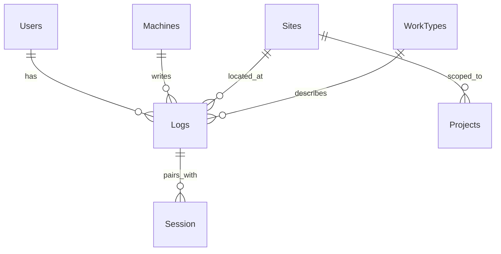

# Smarepo-saas – Codex Review Context

## 1. Project Overview (The "What")
- 目的: NFC を用いた現場日報（打刻→集計→レポート）を **SaaS** として提供
- デプロイ: Vercel（App Router / Edge/Node 混在を想定）
- 外部: Airtable（マスタ・ログ・セッション等を保存）

## 2. Tech Stack (The "How")
- 言語: TypeScript
- フレームワーク: Next.js (App Router)
- UI: Tailwind CSS / React Hook Form
- 状態管理: Zustand（必要箇所のみ）
- 認証: NextAuth (Credentials 予定／または外部IdPに移行予定)
- インフラ: Vercel + (必要に応じて) Cron / Airtable Automation

## 3. Rules & Conventions (The "Rules")
- **Secrets厳守**: APIキーや機密は `.env`／Vercel 環境変数のみ。クライアントへ露出禁止。
- **サーバ/クライアント分離**: Airtable SDK 呼び出しは **サーバのみ**。App Router で厳密運用。
- **設計原則**:
  - データ取得は `lib/**` と `app/**/route.ts` に集約。UI はロジックを持たない。
  - API の入出力はスキーマ（Zod 等）で**バリデーション**。
  - 命名・責務・例外処理の一貫性（関数は純度を優先、UI は副作用を避ける）。
- **品質**:
  - Lint/Format を CI で強制（warning=0）
  - `tsc --noEmit` による型安全
  - 主要ロジックは `node:test` で単体テスト

## 4. Data Model (概略)
主なテーブル：Users / Machines / Sites / WorkTypes / Logs / Session / Projects



## 5. API Surface (例)
- `POST /api/stamp` : 打刻（IN/OUT） + 位置判定（ポリゴン優先→最近傍）
- `GET  /api/masters/sites` : 稼働サイト一覧
- `GET  /api/masters/work-types` : 作業種別一覧
- `GET  /api/calendar/day|month` : 集計
- `POST /api/out-to-session` : OUT ログを Session 化

## 6. Security Notes
- Credentials 認証は**必ずハッシュ化**（bcrypt 等）。平文比較は不可。
- JWT/Session に機密を含めない。クライアントへ渡す情報を最小化。
- 位置情報は**必要最小限**のみ保存。GDPR/プライバシーポリシー整備。
- Gitleaks を CI に組み込み、Secrets 混入を阻止。

## 7. Performance Notes
- App Router: RSC/SSR/ISR を使い分け、API/DB の待機時間を短縮。
- Airtable へのクエリは **フィルタ/フィールド絞り**と**指数バックオフ**で最適化。
- 大きなレスポンスはキャッシュ（必要に応じて ISR）。

## 8. Review Focus (Codexへの明示)
**P0: セキュリティ/パフォーマンス**  
- Secrets 露出がないか（クライアント配信／ログ出力）  
- Airtable 呼び出しがクライアント側に潜んでいないか  
- SSR/ISR の設計ミスや無駄な再レンダリング  

**P1: 設計規約/一貫性**  
- データ取得の集約と責務分離  
- 型安全（`any` 多用や `unknown` 放置の排除）  

**P2: バグ/エッジケース**  
- 非同期の例外/再試行/タイムゾーンの取り扱い  
- 入力バリデーションの不足・境界値

## 9. Focus Files
- `src/lib/airtable.ts`（Airtable SDK ラッパ）
- `src/hooks/useSubscription.ts`（課金/サブスク）
- `app/api/webhook/route.ts`（外部連携）
- `app/api/stamp/route.ts`（位置判定/保存）

## 10. Non-goals
- UI の微小な色/余白調整
- ベンダー ロックインを超える大規模再設計

## 11. How to Run (ローカル)
```bash
pnpm i
pnpm dev
```
環境変数: `AIRTABLE_API_KEY`, `AIRTABLE_BASE_ID`, `NEXTAUTH_SECRET`, ほか
