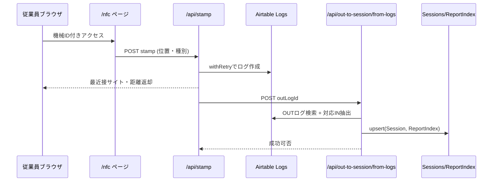
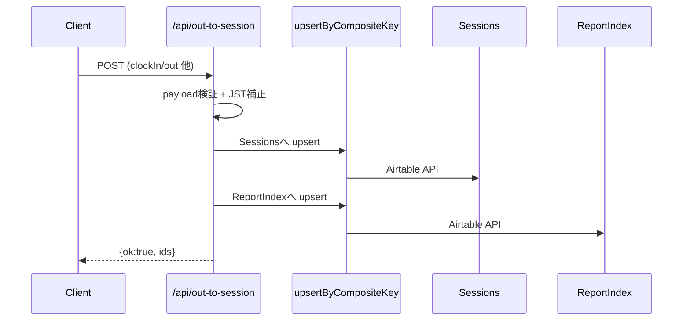
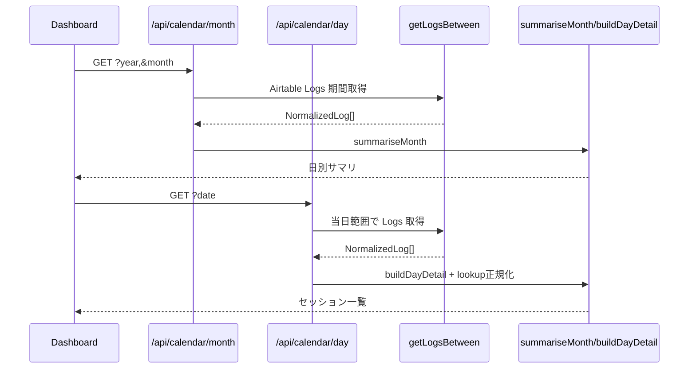

# 1. 概要（Executive Summary）
- Next.js 15 App Router ベースで、NFC打刻や稼働集計を Airtable 上のログ・セッションに同期させる勤怠レポート基盤です。【F:app/(protected)/nfc/page.tsx†L1-L52】【F:app/api/stamp/route.ts†L1-L162】
- サーバ処理は Node.js ランタイムで統一され、Airtable API への再試行ロジックと Excel/PDF 出力機能を備えています。【F:app/api/stamp/route.ts†L15-L160】【F:lib/airtable.ts†L11-L116】【F:app/api/reports/export/excel/route.ts†L1-L158】
- 認証は NextAuth の Credentials プロバイダを利用するが、パスワードを平文比較しており秘匿性に課題があります。【F:lib/auth.ts†L17-L76】
- ビルド・テスト・Lint は成功する一方、`NEXTAUTH_SECRET` 未設定警告や独自 ESLint プラグインの module type 警告が残っています。【F:reports/repo-scan/raw/build.txt†L1-L63】【F:reports/repo-scan/raw/lint.txt†L1-L4】【F:reports/repo-scan/raw/test.txt†L1-L129】

# 2. ディレクトリ構成（要約ツリー）
- `app/` – App Router 配下の保護ページ、API ルート、レポート UI。【F:reports/repo-scan/raw/find-tree.txt†L33-L72】
- `lib/` – 認証、Airtable、地理判定、ロガーなどのサーバサイドユーティリティ。【F:reports/repo-scan/raw/find-tree.txt†L23-L41】
- `src/lib/` – Airtable REST クライアントや Excel 生成などの共有ロジック。【F:reports/repo-scan/raw/find-tree.txt†L31-L46】
- `tests/` – Node Test Runner による API／UI 振る舞いの検証スイート。【F:reports/repo-scan/raw/find-tree.txt†L13-L31】
- `scripts/` – 運用診断・今回追加のリポジトリスキャンスクリプト群。【F:reports/repo-scan/raw/find-tree.txt†L7-L33】

# 3. パッケージとランタイム
| 項目 | バージョン/設定 | 備考 |
| --- | --- | --- |
| next | 15.5.2 | Turbopack ビルド、App Router。【F:package.json†L6-L20】|
| react / react-dom | 19.1.0 | Server Components 前提。【F:package.json†L17-L20】|
| next-auth | 5.0.0-beta.29 | Credentials 認証を採用。【F:package.json†L17-L20】【F:lib/auth.ts†L17-L99】|
| airtable | ^0.12.2 | SDK と REST クライアントの両方を使用。【F:package.json†L13-L20】【F:src/lib/airtable/client.ts†L1-L120】|
| tailwindcss | 3.4.17 | UI トークン定義済み。【F:package.json†L26-L41】|
| TypeScript | ^5 / strict | bundler 解決・path alias を設定。【F:package.json†L26-L41】【F:tsconfig.json†L1-L46】|
| ESLint | ^9 + next/core-web-vitals | JSX a11y カスタムプラグイン連携。【F:package.json†L26-L41】【F:eslint.config.mjs†L1-L39】|
| next.config.ts | 設定未定義（デフォルト） | 追加設定なし。【F:next.config.ts†L1-L7】|
| vercel.json | Cron `/api/out-to-session/backfill` を毎日 17:10 実行。【F:vercel.json†L1-L11】

# 4. ルーティング & API 一覧
| パス | メソッド | 入力主要項目 | 出力 | 認証 | runtime | 備考 |
| --- | --- | --- | --- | --- | --- | --- |
| `/api/auth/[...nextauth]` | GET/POST | NextAuth Credential (username/password) | NextAuth ハンドラ | NextAuth 内部 | default | 平文比較。|【F:app/api/auth/[...nextauth]/route.ts†L1-L1】【F:lib/auth.ts†L17-L99】
| `/api/stamp` | POST | `machineId`,`workDescription`,`lat`,`lon`,`type` 等 | 近傍サイト決定結果 | 必須（`auth()`） | nodejs | Logs に作成後 `/api/out-to-session/from-logs` 呼び出し。|【F:app/api/stamp/route.ts†L26-L155】【F:app/api/stamp/validator.ts†L1-L36】
| `/api/out-to-session` | POST | 出退勤レコード（`clockInAt/Out` 等） | Airtable Sessions/ReportIndex Upsert | なし | nodejs | 入力検証と JST 補正。|【F:app/api/out-to-session/route.ts†L13-L200】
| `/api/out-to-session/from-logs` | POST | `outLogId` | セッション変換結果 | なし | nodejs | OUT ログから IN を特定し upsert。|【F:app/api/out-to-session/from-logs/route.ts†L13-L195】
| `/api/out-to-session/backfill` | POST | 任意 `from/to` | 処理件数 | なし | nodejs | OUT ログを巡回し順次変換、100ms 待機。|【F:app/api/out-to-session/backfill/route.ts†L9-L152】
| `/api/report-index/search` | GET | `year`,`month` 必須 | サマリ一覧 | なし | nodejs | キーワード検索対応。|【F:app/api/report-index/search/route.ts†L7-L133】
| `/api/report-index/sync` | POST | 任意 `year`,`month` | upsert 件数 | なし | nodejs | Sessions を ReportIndex に同期。|【F:app/api/report-index/sync/route.ts†L7-L115】
| `/api/reports/export/excel` | POST | `year`,`month` 必須 | Excel バイナリ | なし | nodejs | 無認証で Excel ダウンロード。|【F:app/api/reports/export/excel/route.ts†L22-L158】
| `/api/reports/month` | GET | `year`,`month`、任意フィルタ | Excel ワークブック | `auth()` | nodejs | セッション表を XLSX 生成。|【F:app/api/reports/month/route.ts†L32-L154】
| `/api/calendar/month` | GET | `year`,`month` | 日別合計 | `auth()` | nodejs | Logs 集計。|【F:app/api/calendar/month/route.ts†L14-L40】
| `/api/calendar/day` | GET | `date` | セッション詳細 | `auth()` | nodejs | Lookup 正規化。|【F:app/api/calendar/day/route.ts†L74-L155】
| `/api/masters/sites` | GET | - | 有効サイト一覧 | なし | default | `active=1` フィルタのみ。|【F:app/api/masters/sites/route.ts†L4-L21】
| `/api/masters/work-types` | GET | - | 有効作業種別 | なし | default | sortOrder 昇順。|【F:app/api/masters/work-types/route.ts†L4-L24】
| `/api/reports/month` ページ | GET | - | 集計ビュー | `auth()` | nodejs | Airtable Session 読み込み。|【F:app/api/reports/month/route.ts†L32-L154】

# 5. 認証・認可の仕組み
- NextAuth Credentials プロバイダでユーザー名とパスワードを Airtable から取得し、平文比較して検証しています。【F:lib/auth.ts†L21-L59】
- JWT セッション戦略を採用し、`token`/`session` コールバックで `id`・`role`・`userId` をセッションへ拡張しています。【F:lib/auth.ts†L67-L85】
- `NEXTAUTH_SECRET` 未設定時はコンソールにエラーを出力するが、ビルド時にも警告が発生するため環境変数の強制設定が必要です。【F:lib/auth.ts†L7-L10】【F:reports/repo-scan/raw/build.txt†L17-L28】
- `/api` 系エンドポイントは middleware の対象外であり、認証不要でアクセス可能です。【F:middleware.ts†L1-L16】

# 6. 環境変数マトリクス
| 変数 | 用途 | 参照箇所 | 必須 | 公開 | 既定値/備考 |
| --- | --- | --- | --- | --- | --- |
| `AIRTABLE_API_KEY` | Airtable 認証 | `lib/airtable.ts` ほか | Yes | Server | 未設定で起動失敗。【F:lib/airtable.ts†L39-L50】|
| `AIRTABLE_BASE_ID` | Airtable ベース指定 | `lib/airtable.ts` ほか | Yes | Server | 未設定で起動失敗。【F:lib/airtable.ts†L39-L50】|
| `AIRTABLE_TABLE_LOGS` | Logs テーブル名 | `lib/airtable/schema.ts` | Optional | Server | 既定 `Logs`。【F:lib/airtable/schema.ts†L1-L6】|
| `AIRTABLE_TABLE_SESSIONS` | セッションテーブル名 | `app/api/out-to-session/*.ts` 等 | Optional | Server | 既定 `Session(s)`。【F:app/api/out-to-session/route.ts†L8-L9】【F:app/api/out-to-session/from-logs/route.ts†L10-L11】|
| `AIRTABLE_TABLE_REPORT_INDEX` | レポート索引 | `app/api/report-index/*` 等 | Optional | Server | 既定 `ReportIndex`。【F:app/api/report-index/search/route.ts†L32-L85】|
| `AIRTABLE_TABLE_PROJECTS` | プロジェクト一覧 | `lib/airtable/projects.ts` | Optional | Server | 既定 `Projects`。【F:lib/airtable/projects.ts†L7-L52】|
| `APP_BASE_URL` | 運用診断のベース URL | `scripts/p1-diagnostics.ts` | Yes (診断ツール) | Server | Trailing `/` 除去。【F:scripts/p1-diagnostics.ts†L48-L89】|
| `NEXTAUTH_SECRET` | JWT 暗号鍵 | `lib/auth.ts` | Yes | Server | 未設定で警告発生。【F:lib/auth.ts†L7-L10】|
| `NEXT_PUBLIC_DEFAULT_MACHINE_ID` | NFC 既定機械 ID | `NfcLinkButton.tsx` | Optional | Public | 既定 `1001`。【F:app/(protected)/dashboard/_components/NfcLinkButton.tsx†L5-L31】|
| `TZ` | タイムゾーン厳密化 | `scripts/p1-diagnostics.ts` | Yes (診断) | Server | `Asia/Tokyo` 必須。【F:scripts/p1-diagnostics.ts†L48-L85】

# 7. Airtable スキーマ推定
| テーブル | 主要フィールド | 型/リンク | 備考 |
| --- | --- | --- | --- |
| Users | `userId`,`name`,`username`,`role`,`active` | 文字列、ブール | Credentials 認証対象。|【F:types/index.ts†L4-L14】【F:lib/auth.ts†L33-L57】
| Machines | `machineid`,`name`,`active` | 文字列/ブール | 打刻時にアクティブ判定。|【F:types/index.ts†L16-L21】【F:app/api/stamp/route.ts†L52-L66】
| Sites | `siteId`,`name`,`lat`,`lon`,`polygon_geojson` | 文字列/数値/GeoJSON | 位置判定・Link 参照。|【F:types/index.ts†L23-L33】【F:lib/geo.ts†L108-L139】
| WorkTypes | `workId`,`name`,`sortOrder`,`active` | 文字列/数値/ブール | マスタ API で `active=1`。|【F:types/index.ts†L35-L42】【F:app/api/masters/work-types/route.ts†L4-L24】
| Logs | `timestamp`,`date`,`user`,`machine`,`lat`,`lon`,`accuracy`,`workDescription`,`type` | 日時・Link・数値 | `filterFields` で登録制限。|【F:types/index.ts†L44-L60】【F:lib/airtableSchema.ts†L1-L23】【F:app/api/stamp/route.ts†L86-L101】
| Sessions | `year`,`month`,`day`,`userId`,`username`,`sitename`,`clockInAt`,`clockOutAt`,`hours` | 数値・文字列 | 月集計 API と Excel 出力に利用。|【F:lib/airtable/sessions.ts†L12-L103】
| ReportIndex | `date`,`sitename`,`username`,`machinename`,`workdescription`,`hours` | 文字列/数値 | 検索と Excel エクスポートに使用。|【F:app/api/report-index/search/route.ts†L26-L127】【F:app/api/reports/export/excel/route.ts†L13-L152】
| Projects | `projectId`,`name`,`site`,`status`,`progressPercent`,`spreadsheetUrl` | 文字列/Link/数値 | 現場ごとの代表案件解決。|【F:lib/airtable/projects.ts†L7-L195】

**注意点**
- Logs↔Sessions 間の連携は OUT ログをトリガに IN ログを探索するため、重複やマッチ失敗時の再試行が `backfill` エンドポイント頼みになる設計です。【F:app/api/out-to-session/from-logs/route.ts†L110-L195】
- Geo 判定は最も近い現場を距離閾値なしで選択するため、遠隔位置の誤判定リスクがあります。【F:lib/geo.ts†L108-L139】【F:app/api/stamp/route.ts†L74-L151】

# 8. ユースケースのシーケンス図（Mermaid）

# 9. 品質チェック結果
- ✅ `pnpm -s lint` – Node 警告のみで終了、型付け未設定警告が発生。【F:reports/repo-scan/raw/lint.txt†L1-L4】
- ✅ `pnpm -s test` – 21 件すべて成功、Geo テストで無効入力の警告ログ有り。【F:reports/repo-scan/raw/test.txt†L1-L129】
- ✅ `pnpm -s build` – 成功。ただし `NEXTAUTH_SECRET` 未設定と module type 警告が多数出力。【F:reports/repo-scan/raw/build.txt†L1-L63】

# 10. リスク一覧（Top10）
| # | 重大度 | 発生可能性 | リスク | 根拠 | 対策案 |
| --- | --- | --- | --- | --- | --- |
| 1 | High | High | Credentials 認証でパスワード平文比較のまま保管される | 【F:lib/auth.ts†L21-L59】 | ハッシュ化（bcrypt/argon2）＋ Airtable 側のハッシュ保存に移行 |
| 2 | High | High | `NEXTAUTH_SECRET` 未設定だと JWT が脆弱・ビルド警告 | 【F:lib/auth.ts†L7-L10】【F:reports/repo-scan/raw/build.txt†L17-L28】 | 環境変数を Preview/Prod で必須化し CI で検証 |
| 3 | High | Medium | `/api/out-to-session` 等が無認証公開でデータ改ざん可能 | 【F:middleware.ts†L1-L16】【F:app/api/out-to-session/route.ts†L13-L200】 | API トークン or NextAuth 認証を必須化 |
| 4 | High | Medium | `/api/reports/export/excel` が認証なしでデータ全件ダウンロード | 【F:app/api/reports/export/excel/route.ts†L81-L158】 | 認証・レート制限・署名付き URL 導入 |
| 5 | Medium | Medium | Geo 判定が距離閾値無しで最寄り採用 → 誤打刻リスク | 【F:lib/geo.ts†L108-L139】【F:app/api/stamp/route.ts†L74-L151】 | サイト半径や距離上限でエラーを返す |
| 6 | Medium | Medium | Cron `/api/out-to-session/backfill` も無認証で公開 | 【F:vercel.json†L5-L11】【F:app/api/out-to-session/backfill/route.ts†L21-L152】 | Cron 専用トークン検証・IP 制限 |
| 7 | Medium | Medium | Airtable API キー未設定でアプリ起動時に例外 → 可用性低下 | 【F:lib/airtable.ts†L39-L50】 | 起動前診断・環境バリデーション導入 |
| 8 | Medium | Low | `scripts/p1-diagnostics.ts` が `TZ` 固定を要求しズレると失敗 | 【F:scripts/p1-diagnostics.ts†L48-L89】 | `.env.example` 整備と CLI の警告改善 |
| 9 | Low | Medium | ESLint カスタムプラグインの module type 警告で CI ノイズ | 【F:reports/repo-scan/raw/lint.txt†L1-L4】 | `package.json` に `"type": "module"` または CommonJS 化 |
|10 | Low | Medium | `NEXT_PUBLIC_DEFAULT_MACHINE_ID` 既定値が固定でサイト単位運用に不整合 | 【F:app/(protected)/dashboard/_components/NfcLinkButton.tsx†L5-L31】 | 拠点別設定・ユーザー毎の保存導入 |

# 11. 推奨アクション（次の一手）
1. **高優先**: Credentials 認証をハッシュ化（bcrypt 等）し、Airtable のパスワードフィールドを移行。【F:lib/auth.ts†L21-L59】
2. **高優先**: `/api/out-to-session` / `/api/reports/export/excel` に NextAuth セッションまたは共有トークン認証を追加。【F:middleware.ts†L1-L16】【F:app/api/reports/export/excel/route.ts†L81-L158】
3. **高優先**: `NEXTAUTH_SECRET` を環境変数テンプレートに追加し、ビルド時に未設定をエラー化。【F:reports/repo-scan/raw/build.txt†L17-L28】
4. **中優先**: Geo 判定に距離上限（例: 100m）を導入し、閾値超過時は警告と管理者承認フローを追加。【F:lib/geo.ts†L108-L139】【F:app/api/stamp/route.ts†L74-L151】
5. **中優先**: ESLint プラグインを ES Module 宣言するかビルド警告抑制する設定を適用。【F:reports/repo-scan/raw/lint.txt†L1-L4】
6. **中優先**: `.env.example` とドキュメントを更新し、`TZ` や Airtable テーブル名既定を明示。【F:scripts/p1-diagnostics.ts†L48-L91】
7. **低優先**: NFC ボタンの既定機械 ID を管理画面で設定可能にし、多現場運用へ対応。【F:app/(protected)/dashboard/_components/NfcLinkButton.tsx†L5-L31】

# 12. 付録（収集コマンド結果リンク）
- [git-root](../../reports/repo-scan/raw/git-root.txt)
- [リポジトリツリー(find)](../../reports/repo-scan/raw/find-tree.txt)
- [scan JSON](../../reports/repo-scan/raw/scan.json)
- [lintログ](../../reports/repo-scan/raw/lint.txt)
- [testログ](../../reports/repo-scan/raw/test.txt)
- [buildログ](../../reports/repo-scan/raw/build.txt)
- [pnpm/node/git バージョン](../../reports/repo-scan/raw/pnpm-version.txt), (../../reports/repo-scan/raw/node-version.txt), (../../reports/repo-scan/raw/git-head.txt)
